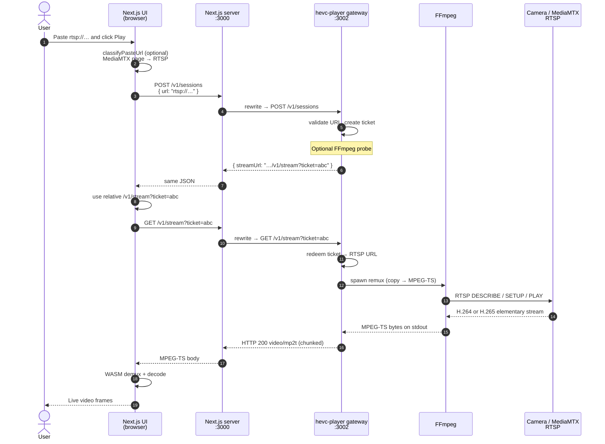
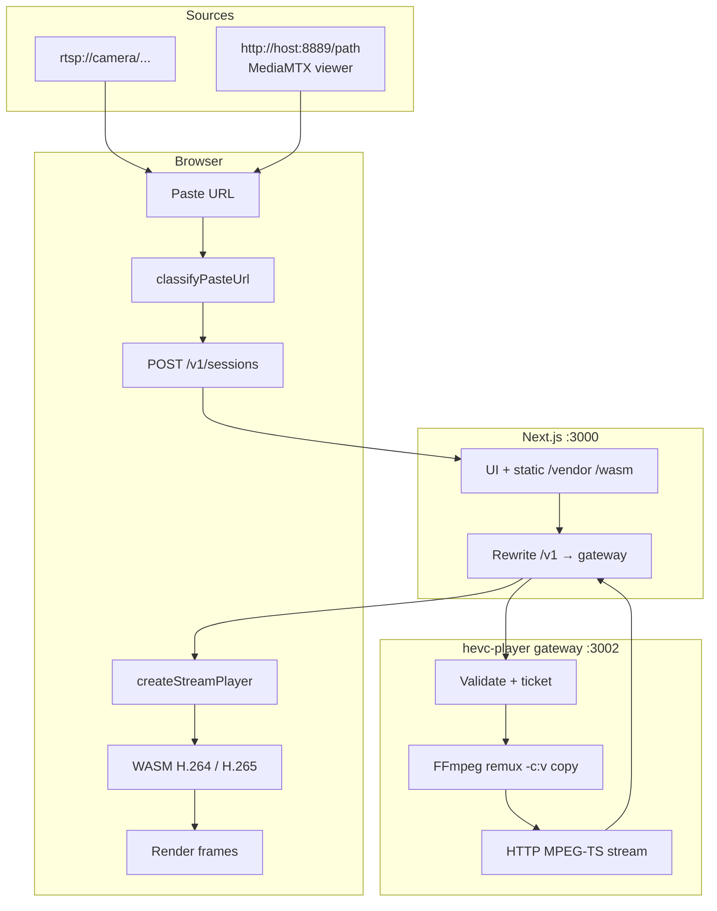

# How RTSP is played in the browser

This document describes the end-to-end flow used by **rtsp_stream** (Next.js) and the **hevc-player** npm package.

Browsers cannot open `rtsp://` URLs. Playback works by remuxing RTSP on a Node gateway into HTTP MPEG-TS, then decoding H.264/H.265 with WebAssembly in the browser.

---

## Architecture overview

```text
┌─────────────────┐
│ Camera / NVR /  │
│ MediaMTX        │
└────────┬────────┘
         │ RTSP (TCP)
         ▼
┌─────────────────┐
│ hevc-player     │  FFmpeg: -c:v copy (no transcode)
│ gateway :3002   │  RTSP → MPEG-TS pipe
└────────┬────────┘
         │ HTTP  video/mp2t
         ▼
┌─────────────────┐
│ Next.js app     │  UI + rewrite /v1 → gateway
│ :3000           │  Serves /vendor + /wasm assets
└────────┬────────┘
         │ same-origin /v1/stream?ticket=…
         ▼
┌─────────────────┐
│ Browser         │  hevc-player WASM decode
│ (Chrome, etc.)  │  H.264 / H.265 → on-screen frames
└─────────────────┘
```

---

## Sequence flow



---

## Component flow (who does what)



---

## Step-by-step detail

### 1. User pastes a URL

Examples:

- Direct RTSP: `rtsp://127.0.0.1:8554/camera1`
- MediaMTX viewer: `http://127.0.0.1:8889/camera1` → derived to `rtsp://127.0.0.1:8554/camera1`

### 2. Browser registers a remux session

```http
POST /v1/sessions
Content-Type: application/json

{ "url": "rtsp://127.0.0.1:8554/camera1" }
```

The browser calls **Next.js** (same origin), not the camera.

### 3. Next.js proxies to the gateway

Configured in `next.config.ts`:

```text
/v1/:path*  →  HEVC_GATEWAY_URL/v1/:path*
             (default http://127.0.0.1:3002)
```

`127.0.0.1` here means “gateway on the same host as Next,” not “the user’s camera.”

### 4. Gateway creates a ticket

1. Validates the URL (rtsp, hls, srt, rtmp, …)
2. Optionally probes with FFmpeg
3. Stores the source URL under a random ticket id
4. Returns a play URL, e.g. `/v1/stream?ticket=abc…`

Tickets keep credentials out of long-lived browser URLs and access logs.

### 5. Gateway remuxes when the stream is opened

On `GET /v1/stream?ticket=…`:

1. Look up the RTSP URL from the ticket
2. Start FFmpeg roughly as:

   ```text
   ffmpeg -rtsp_transport tcp -i <rtsp>
          -map 0:v:0 -an -c:v copy -f mpegts pipe:1
   ```

3. Stream stdout as `Content-Type: video/mp2t`

**Copy** means no re-encode: H.265 stays H.265, H.264 stays H.264. Latency stays low; CPU cost on the server is small.

### 6. WASM player decodes in the browser

`createStreamPlayer` / `createHevcPlayer`:

1. Loads `/vendor/avplayer.js` and `/wasm/hevc-simd.wasm` (or `h264-simd.wasm`)
2. Fetches the MPEG-TS HTTP stream
3. Demuxes and decodes in a worker
4. Draws frames (WebGL / canvas)

Requires COOP/COEP headers for SharedArrayBuffer workers:

```text
Cross-Origin-Opener-Policy: same-origin
Cross-Origin-Embedder-Policy: require-corp
```

---

## Processes that must be running

| Process | Role | Typical command |
|--------|------|-----------------|
| Next.js | UI, assets, `/v1` proxy | part of `pnpm run dev` / `pnpm run start` |
| hevc-player gateway | RTSP → MPEG-TS | same scripts (spawns `hevc-player gateway`) |
| FFmpeg | Remux binary on PATH | installed on the host |
| Camera / MediaMTX | RTSP publisher | external |

The npm package **ships** the gateway code. A **running Node process** must execute it. Browsers cannot run FFmpeg or open RTSP themselves.

```text
pnpm run dev    →  gateway + Next (development)
pnpm run start  →  gateway + Next (production, after build)
```

---

## Data on the wire

| Hop | Protocol | Payload |
|-----|----------|---------|
| Camera → gateway | RTSP over TCP | H.264 or H.265 elementary stream |
| Gateway → Next → browser | HTTP | MPEG-TS (`video/mp2t`) |
| Inside browser | — | Decoded YUV/RGB frames |

---

## What this path is not

| Not used for main H.265 path | Why |
|------------------------------|-----|
| Raw RTSP in the browser | No browser RTSP API |
| WebRTC / WHEP as default | Native HEVC WebRTC is not portable |
| Server transcode to another codec | Remux only (`-c:v copy`) |

Optional WHEP exists in the package for native WebRTC when codecs allow; reliable H.265 on all browsers uses the remux + WASM path above.

---

## Env knobs (rtsp_stream)

| Variable | Meaning |
|----------|---------|
| `HEVC_GATEWAY_URL` | Where Next rewrites `/v1` (default `http://127.0.0.1:3002`) |
| `HEVC_GATEWAY_PORT` | Gateway listen port |
| `GATEWAY_ORIGINS` | Allowed browser Origins for the gateway |
| `HOSTNAME` / `PORT` | Next bind address |

See `.env.example` in this project.

---

## One-line summary

**RTSP is pulled by the hevc-player gateway with FFmpeg, remuxed to MPEG-TS over HTTP, proxied through Next.js, and decoded by WASM in the browser.**
